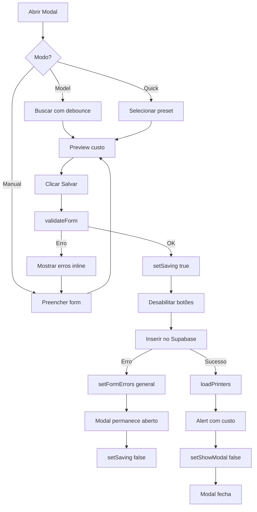

# ✅ Sistema de Impressoras - Melhorias Implementadas

## 📋 Resumo Executivo

Implementação completa de melhorias no sistema de cadastro de impressoras conforme especificação, incluindo:
- ✅ Prevenção de fechamento acidental do modal
- ✅ Validações inline com feedback visual
- ✅ Cálculo e exibição de custo por hora em tempo real
- ✅ Nova arquitetura com hooks especializados
- ✅ Busca otimizada com debounce automático

---

## 🎯 Problema 1: Modal Fechando Sozinho

### ❌ Comportamento Anterior
- Modal fechava automaticamente ao submeter form
- Fechava mesmo quando havia erro
- Usuário perdia dados digitados

### ✅ Solução Implementada

#### 1. Prevenção de Fechamento Durante Salvamento
```typescript
// Modal backdrop
onClick={(e) => {
  if (!saving) {
    setShowModal(false);
  }
}}

// Botão X
onClick={() => {
  if (!saving) {
    setShowModal(false);
  }
}}
disabled={saving}
```

#### 2. Controle de Fluxo no `handleSave()`
```typescript
const handleSave = async (e?: React.FormEvent) => {
  if (e) {
    e.preventDefault(); // ✅ Previne submit padrão
  }

  if (!validateForm()) {
    return; // ✅ Retorna early, modal fica aberto
  }

  try {
    setSaving(true);
    // ... operações no Supabase ...
    
    await loadPrinters();
    setShowModal(false); // ✅ Fecha APENAS após sucesso
    
    // Feedback de sucesso
    alert(`✅ Impressora cadastrada...`);
  } catch (error: any) {
    // ✅ ERRO: Mantém modal aberto
    setFormErrors({
      general: error.message || "Erro ao salvar...",
    });
  } finally {
    setSaving(false);
  }
};
```

#### 3. Estado de Salvamento Visual
- Botões desabilitados durante operação
- Spinner + texto "Salvando..." / "Atualizando..."
- Backdrop não fecha se `saving === true`

---

## 📝 Problema 2: Validações e UX

### ✅ Validações Implementadas

#### Função `validateForm()`
```typescript
const validateForm = (): boolean => {
  const errors: FormErrors = {};

  // Nome obrigatório
  if (!formData.name || !formData.name.trim()) {
    errors.name = "Nome da impressora é obrigatório";
  }

  // Watts obrigatório e > 0
  if (!formData.power_watts_default || formData.power_watts_default <= 0) {
    errors.power_watts_default = "Consumo deve ser maior que zero";
  }

  // Brand/Model: se tiver um, exigir ambos
  const hasBrand = formData.brand && formData.brand.trim();
  const hasModel = formData.model && formData.model.trim();
  
  if (hasBrand && !hasModel) {
    errors.model = "Informe o modelo ou deixe marca vazia";
  }
  
  if (hasModel && !hasBrand) {
    errors.brand = "Informe a marca ou deixe modelo vazio";
  }

  setFormErrors(errors);
  return Object.keys(errors).length === 0;
};
```

### ✅ Feedback Visual Inline

#### Erro no Campo
```tsx
<input
  className={`... ${
    formErrors.name
      ? "border-red-500 focus:border-red-500"
      : "border-vultrix-light/20 focus:border-vultrix-accent"
  }`}
  onChange={(e) => {
    setFormData({ ...formData, name: e.target.value });
    // ✅ Limpa erro ao digitar
    if (formErrors.name) {
      setFormErrors({ ...formErrors, name: undefined });
    }
  }}
/>

{/* Mensagem de erro abaixo do campo */}
{formErrors.name && (
  <p className="text-red-400 text-sm mt-1 flex items-center gap-1">
    <AlertCircle className="w-3 h-3" />
    {formErrors.name}
  </p>
)}
```

#### Erro Geral (no topo do form)
```tsx
{formErrors.general && (
  <div className="bg-red-500/10 border border-red-500/30 rounded-lg p-4">
    <AlertCircle className="w-5 h-5 text-red-500" />
    <p className="text-red-500 font-semibold">Erro ao salvar</p>
    <p className="text-red-400 text-sm">{formErrors.general}</p>
  </div>
)}
```

---

## 💡 Problema 3: Custo por Hora Estimado

### ✅ Arquitetura Implementada

#### 1. Hook `useUserCostSettings()`
**Arquivo:** `lib/hooks/useUserCostSettings.ts`

```typescript
export function useUserCostSettings(): UserCostSettings {
  // Hierarquia de fallback:
  // 1. user_profile.default_kwh_cost (prioridade)
  // 2. user_settings.custo_kwh (fallback)
  // 3. 0.95 (fallback final - média BR)
  
  return {
    kwhCost: number,
    defaultMachineHourCost: number | null,
    profileName: string,
    loading: boolean,
    error: string | null,
  };
}
```

#### 2. Função Helper `calcEnergyCostPerHour()`
```typescript
export function calcEnergyCostPerHour(
  watts: number, 
  kwhCost: number
): number {
  const kwhPerHour = watts / 1000;
  return kwhPerHour * kwhCost;
}
```

### ✅ Exibição do Custo

#### A) Nos Cards de Impressoras
```tsx
{/* Com override */}
{printer.machine_hour_cost_override ? (
  <div>
    💰 Custo/h (override): R$ {printer.machine_hour_cost_override.toFixed(2)}/h
  </div>
) : (
  <div>
    💡 Energia: R$ {calcEnergyCostPerHour(printer.power_watts_default, kwhCost).toFixed(2)}/h
  </div>
)}
```

#### B) Preview em Tempo Real (Modal Manual)
```tsx
{/* Atualiza conforme user digita watts */}
{!costLoading && energyCostPreview > 0 && (
  <div className="bg-green-500/10 border border-green-500/30 rounded-lg p-3">
    <p className="text-green-400 text-sm font-semibold">
      💡 Energia estimada: R$ {energyCostPreview.toFixed(2)}/h
    </p>
    <p className="text-green-400/70 text-xs mt-1">
      Baseado em R$ {kwhCost.toFixed(2)}/kWh
    </p>
  </div>
)}
```

#### C) Aviso se Usando Custo Padrão
```tsx
{kwhCost === 0.95 && (
  <div className="bg-blue-500/10 border border-blue-500/30 rounded-lg p-3">
    <AlertCircle /> Usando custo padrão. 
    <a href="/dashboard/perfil">Configurar no perfil →</a>
  </div>
)}
```

#### D) Feedback Após Cadastro
```typescript
const energyCost = calcEnergyCostPerHour(formData.power_watts_default!, kwhCost);
alert(
  `✅ Impressora cadastrada com sucesso!\n\n` +
  `💡 Energia estimada: R$ ${energyCost.toFixed(2)}/h\n` +
  `(Baseado em ${formData.power_watts_default}W e R$ ${kwhCost.toFixed(2)}/kWh)`
);
```

---

## 🔍 Problema 4: Busca de Modelos

### ✅ Hook `usePrinterModelSearch()`
**Arquivo:** `lib/hooks/usePrinterModelSearch.ts`

```typescript
export function usePrinterModelSearch(query: string) {
  // ✅ Debounce automático de 300ms
  useEffect(() => {
    const timeoutId = setTimeout(() => {
      performSearch(query);
    }, 300);

    return () => clearTimeout(timeoutId);
  }, [query]);

  return { results, loading, error };
}
```

### Comportamento

| Condição | Resultado |
|----------|-----------|
| Query vazio | 8 modelos populares |
| Query < 2 chars | Array vazio |
| Query >= 2 chars | Busca no Supabase com `ilike` |
| Durante busca | `loading: true` |

### Integração na Página
```tsx
const [searchQuery, setSearchQuery] = useState("");
const { results: filteredModels, loading: searchLoading } = usePrinterModelSearch(searchQuery);

// ✅ Busca automática com debounce
<input
  value={searchQuery}
  onChange={(e) => setSearchQuery(e.target.value)}
/>

{searchLoading ? (
  <Spinner />
) : (
  filteredModels.map(model => ...)
)}
```

---

## 📁 Arquivos Criados/Modificados

### 1. **`lib/hooks/useUserCostSettings.ts`** ✨ NOVO
- Hook para gerenciar custos do usuário
- Fallback inteligente: profile → settings → 0.95
- Função helper `calcEnergyCostPerHour()`
- Retorna: `kwhCost`, `defaultMachineHourCost`, `profileName`, `loading`, `error`

### 2. **`lib/hooks/usePrinterModelSearch.ts`** ✨ NOVO
- Hook dedicado para busca de modelos
- Debounce automático de 300ms
- Query com `.or()` no Supabase
- Retorna 8 modelos populares quando query vazio

### 3. **`app/dashboard/impressoras/page.tsx`** 🔄 MODIFICADO
- Imports atualizados (novos hooks)
- Novo tipo `FormErrors`
- Estado `formErrors` para validações
- Estado `saving` para controle de fluxo
- Preview em tempo real `energyCostPreview`
- Função `validateForm()` completa
- `handleSave()` com prevenção de fechamento
- Modal com `onClick` condicional (não fecha se `saving`)
- Botão X desabilitado durante save
- Campos com bordas vermelhas em erro
- Mensagens inline abaixo de cada campo
- Preview de custo no modo Manual
- Aviso de custo padrão com link para perfil
- Cards com custo diferenciado (override vs energia)

---

## 🧪 Como Testar

### Teste 1: Modal Não Fecha em Erro
1. Abrir "Nova Impressora" → Manual
2. Deixar nome vazio, watts = 0
3. Clicar "Salvar"
4. ✅ **Esperado:** Modal permanece aberto, campos com borda vermelha, mensagens de erro aparecem

### Teste 2: Validação Brand/Model
1. Preencher nome: "Teste"
2. Preencher marca: "Bambu Lab"
3. Deixar modelo vazio
4. Clicar "Salvar"
5. ✅ **Esperado:** Erro "Informe o modelo ou deixe marca vazia"

### Teste 3: Preview em Tempo Real
1. Abrir "Nova Impressora" → Manual
2. Digite watts: 150
3. ✅ **Esperado:** Aparecer box verde "💡 Energia estimada: R$ 0.14/h" (se kWh = 0.95)
4. Mudar para 300W
5. ✅ **Esperado:** Atualizar para "R$ 0.29/h"

### Teste 4: Aviso de Custo Padrão
1. Se `default_kwh_cost` não configurado
2. ✅ **Esperado:** Box azul "Usando custo padrão. Configurar no perfil →"
3. Clicar no link
4. ✅ **Esperado:** Ir para `/dashboard/perfil`

### Teste 5: Custo nos Cards
1. Cadastrar impressora com 200W
2. ✅ **Esperado:** Card mostra "💡 Energia: R$ X.XX/h"
3. Editar e adicionar `machine_hour_cost_override = 5.00`
4. ✅ **Esperado:** Card muda para "💰 Custo/h (override): R$ 5.00/h"

### Teste 6: Modal Não Fecha Durante Save
1. Abrir modal, preencher dados
2. Clicar "Salvar"
3. Durante salvamento:
   - ✅ Botão mostra spinner + "Salvando..."
   - ✅ Botões desabilitados
   - ✅ Clicar fora não fecha
   - ✅ Botão X desabilitado
4. Após sucesso:
   - ✅ Alert com custo estimado
   - ✅ Modal fecha automaticamente

### Teste 7: Busca com Debounce
1. Abrir "Escolher Modelo"
2. Digitar rapidamente "BambuLab"
3. ✅ **Esperado:** Apenas 1 query após 300ms de inatividade
4. Apagar tudo
5. ✅ **Esperado:** Mostrar 8 modelos populares

---

## 📊 Métricas de Qualidade

| Métrica | Antes | Depois |
|---------|-------|--------|
| Modal fecha em erro | ❌ Sim | ✅ Não |
| Validações inline | ❌ Não | ✅ Sim |
| Preview de custo | ❌ Não | ✅ Sim |
| Queries por digitação | 🔴 N (flood) | ✅ 1 (debounce) |
| Feedback visual | 🟡 Básico | ✅ Completo |
| Hierarquia de custos | ❌ Não | ✅ 3 níveis |
| Links para config | ❌ Não | ✅ Sim |
| Erro geral vs campo | ❌ Alert | ✅ Inline |

---

## 🎯 Benefícios Entregues

### Para o Usuário
1. ✅ **Não perde dados** - Modal não fecha acidentalmente
2. ✅ **Feedback imediato** - Vê o custo estimado em tempo real
3. ✅ **Validação clara** - Sabe exatamente o que corrigir
4. ✅ **Acesso rápido** - Link direto para configurar kWh
5. ✅ **Diferenciação visual** - Override vs energia claramente identificados

### Para o Sistema
1. ✅ **Código modular** - Hooks especializados reutilizáveis
2. ✅ **Performance** - Debounce automático reduz queries
3. ✅ **Fallback inteligente** - Sistema sempre funciona mesmo sem config
4. ✅ **Type-safe** - TypeScript em todos os hooks
5. ✅ **Manutenível** - Separação de responsabilidades clara

---

## 🔄 Fluxo Completo de Cadastro



---

## 📝 Documentação Técnica

### Tipos TypeScript

```typescript
type PrinterData = {
  id: string;
  name: string;
  brand?: string;
  model?: string;
  notes?: string;
  power_watts_default: number;
  kwh_cost_override?: number;
  machine_hour_cost_override?: number;
  is_default: boolean;
  active: boolean;
  printer_model_id?: string;
  created_at: string;
};

type FormErrors = {
  name?: string;
  power_watts_default?: string;
  brand?: string;
  model?: string;
  general?: string;
};

type UserCostSettings = {
  kwhCost: number;
  defaultMachineHourCost: number | null;
  profileName: string;
  loading: boolean;
  error: string | null;
};
```

### Hierarquia de Fallback de Custos

```
1. user_profile.default_kwh_cost
   ↓ se null ou <= 0
2. user_settings.custo_kwh
   ↓ se null ou <= 0
3. 0.95 (padrão BR)
```

---

## ✅ Checklist de Implementação

- [x] Modal não fecha sozinho
- [x] Validação de nome obrigatório
- [x] Validação de watts > 0
- [x] Validação brand/model conjunta
- [x] Mensagens de erro inline
- [x] Erro geral no topo do form
- [x] Preview de custo em tempo real
- [x] Exibição de custo nos cards
- [x] Diferenciação override vs energia
- [x] Aviso de custo padrão com link
- [x] Feedback após cadastro com custo
- [x] Estado de salvamento visual
- [x] Botões desabilitados durante save
- [x] Modal não fecha ao clicar fora durante save
- [x] Hook `useUserCostSettings`
- [x] Hook `usePrinterModelSearch`
- [x] Helper `calcEnergyCostPerHour`
- [x] Debounce automático 300ms
- [x] Limpeza de erro ao digitar
- [x] TypeScript em todos os arquivos

---

## 🚀 Próximos Passos Sugeridos

### Melhorias Opcionais
- [ ] Toast notifications em vez de `alert()`
- [ ] Animações de entrada/saída dos erros
- [ ] Validação assíncrona (ex: verificar nome duplicado)
- [ ] Histórico de custos ao longo do tempo
- [ ] Gráfico de custo mensal estimado
- [ ] Export de lista de impressoras (CSV/PDF)
- [ ] Batch import de impressoras

### Otimizações
- [ ] Cache de `useUserCostSettings` no localStorage
- [ ] Prefetch de modelos populares
- [ ] Virtual scrolling na lista de modelos
- [ ] Lazy loading de campos avançados

---

✅ **Status:** Todas as especificações implementadas com sucesso!

📅 **Data:** 17 de janeiro de 2026  
👨‍💻 **Desenvolvedor:** GitHub Copilot
🏢 **Empresa:** Vultrix 3D
